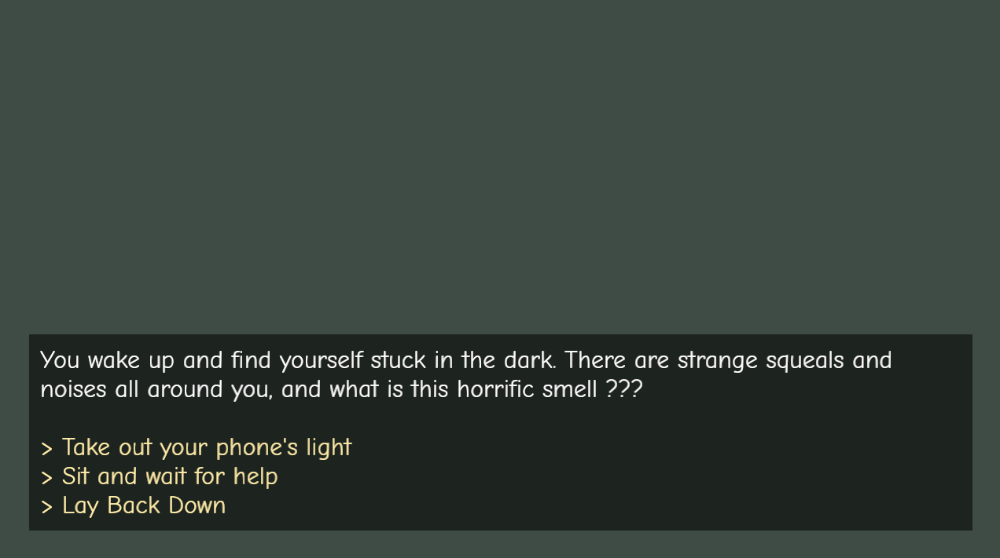

# Sewer Rats

Author: Leo Gong

Design: The story is a bunch of interconnected and winding paths that can lead to either death or escape. Use reason and instinct to make your way out. 

Text Drawing: Text is rendered at runtime as nothing is pre-rendered or baked into image files. The pipeline uses Harfbuzz which turns a UTF-8 string into a 
sequence of glyphs with an 8-bit coverage bitmap only when its needed. The rasterized glyphs are packed into a 512x512 texture and cached into a map so that 
a repeated glyph doesn't need to be re-uplaoded / rasterized. This helps scale the amount of text so that in the case we have hundreds of thousands of chars and words we don't lose out on efficiency. The text drawing reuses a lot of the code from the existing ColorTextureProgram.cpp file since the texture map is a single GL_R8 channel with a set swizzle mask so that R/G/B reads as just a white color. The alpha channel reads the stored coverage value so our tex color shader can create a tintable anti-aliased glyph without creating new shader code. 

The pipeline for this can be found in the Font cpp and hpp files, where all of the above is implemented. 

Choices: The narrative was created fully in Twine as a visual node graph, and then exported to Twee plain text. Story hpp and cpp files parse the Twee files that reads it once on startup and maps it into a passage, where each passage holds both the narrative text and a vector of choices that contain label / target pairs. The PlayMode just tracks the current_passage string in the map of passages, and the branching is jsut reassigning the string to whatever a clicked choice's target name is. 

Screen Shot:

How To Play:

Choose the most instinct based / reasonable options for choices. Some things that seem eerie will most likely be eerie.

Notes: Unfortunately, couldn't fit enough time to create visual assets and import the pipeline for a 2d Visual Novel-like experience. Had some ready, but couldn't get the 2D pipeline and sound changes in time. 

Sources: Vesteria OST : Nilgarf Sewers composed by BSlick (music) 

This game was built with [NEST](NEST.md).

